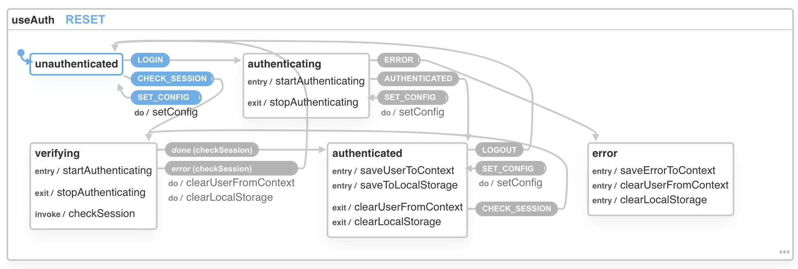

# API Reference

Discoverability via TypeScript types is a design goal for `useAuth`. Nevertheless, this page aims to describe all user-facing APIs and how you might use them.

The API for `useAuth` comes in 3 parts:

1. `<AuthConfig />` to configure auth
2. `useAuth()` to interact with the auth system
3. `dispatch()` for direct access to the underlying XState machine

## AuthConfig

`<AuthConfig />` is a component that helps you configure `useAuth`. You don't need to use AuthConfig but it makes life easier.

`<AuthConfig />` accepts 3 props:

-   `authProvider`, an auth provider class conforming to the [auth providers](/docs/auth-providers) spec
-   `navigate`, a routing function for your environment
-   `params`, optional params object to configure your auth provider. Each auth provider defines its own API for params
-   `children`, optional React children if you prefer wrapping. But AuthConfig is not a context provider.

The component ensures your auth provider is initialized and sessions are checked on render. You can do this yourself with the [dispatch() API](/docs/api-reference#dispatch).

## useAuth()

The `useAuth()` hook is the main API you use to interact with this library.

```jsx
const Component = () => {
    const { ... } = useAuth()

    // do stuff

    return <RenderStuff />
}
```

The hook exposes these values:

-   `isAuthenticating`, boolean whether we're currently authenticating. Great for loading spinners
-   `isAuthenticated()`, method to check if user is currently authenticated
-   `isAuthorized()`, method to check if user has the right roles or scopes
-   `user`, object with user properties; differs between providers
-   `userId`, string identifying the current user
-   `authResult`, object with the latest authentication result
-   `login()`, function to trigger login process
-   `signup()`, function to trigger signup process
-   `logout()`, function to trigger logout process
-   `handleAuthentication()`, function to use in auth callback pages
-   `dispatch()`, function to access the underlying XState machinery

If your editor supports TypeScript and JSDoc hinting, you should see a list of these APIs every time you use `useAuth`.

## dispatch()

[`useAuth`](https://useauth.dev) uses [XState](https://xstate.js.org/) to manage state.



You can use the exposed `dispatch()` method to trigger actions manually. `<AuthConfig>` uses this to handle configuration.

Run this code in any React component to get access:

```javascript
const { dispatch } = useAuth();

// dispatch('ACTION')
// dispatch('ACTION', { payload })
```

You can then fire any of these actions:

-   `LOGIN` starts the login process
-   `CHECK_SESSION` verifies the current user session
-   `SET_CONFIG` configures useAuth
-   `ERROR` moves the machine into an error end-state
-   `AUTHENTICATED` sets user data
-   `LOGOUT` clears user data

Using `dispatch()` manually is discouraged. The most common use-case is for configuring `useAuth` without the `<AuthConfig>` component.

```jsx
// how AuthConfig uses dispatch()

export const AuthConfig = ({
    authProvider,
    params,
    navigate,
    children
}) => {
    const { dispatch } = useAuth();

    const callbackDomain =
        typeof window !== "undefined"
            ? `${window.location.protocol}//${window.location.host}`
            : "http://localhost:8000";

    React.useEffect(() => {
        // instantiate auth provider on page load
        const authInstance = new authProvider({
            dispatch,
            ...authProvider.addDefaultParams(
                params as ProviderOptions,
                callbackDomain
            )
        });

        // set config in XState
        dispatch("SET_CONFIG", {
            authProvider: authInstance,
            navigate,
            callbackDomain
        });

        dispatch("CHECK_SESSION");
    }, [dispatch, authProvider, params, navigate]);

    return <>{children}</>;
};
```
