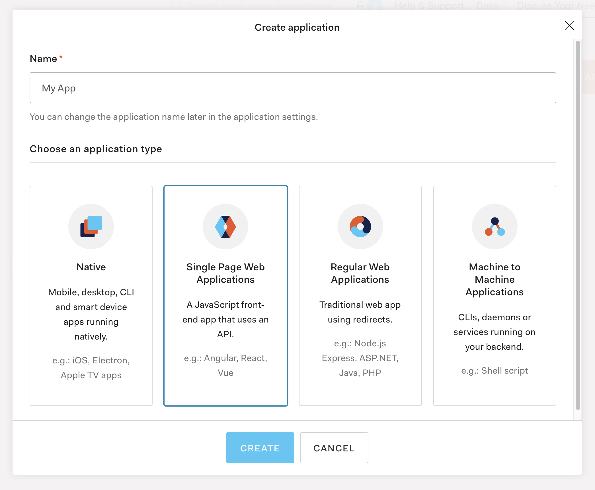
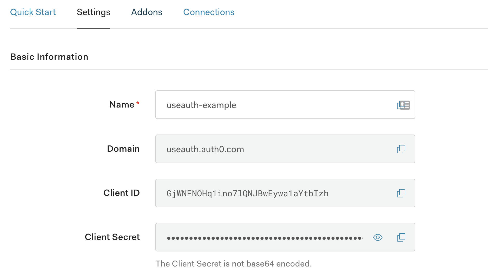
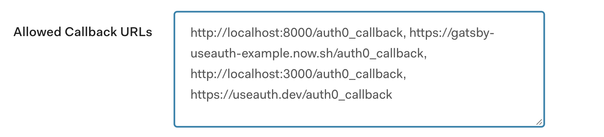
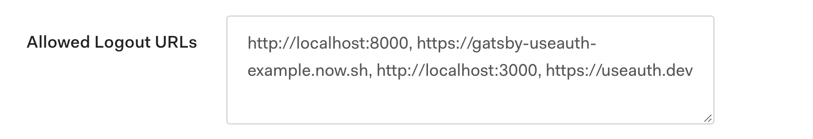
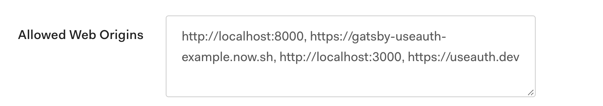

# Use with Auth0

`useAuth` was originally created with Auth0 in mind. It uses the [`auth0-js`](https://github.com/auth0/auth0.js) library under the hood and supports all the same configuration.

example app 👉 [examples/useauth-gatsby-auth0](https://github.com/Swizec/useAuth/tree/master/examples/useauth-gatsby-auth0)

## 1. Create a new application on Auth0

Go to your [Auth0 Dashboard](manage.auth0.com/dashboard), find the tenant you wish to use, and create a new Single Page Application.



Once created, go to settings and find your Domain and ClientID. You'll need them to configure `useAuth`.



## 2. Configure your Auth0 app

Auth0 is strict about which websites can and can't initiate a login flow for your users. This ensures your users can't fall prey to hacking attempts and get their auth stolen.

Wouldn't want some other website to pretend they're you 😉

Scroll down in settings and configure:

1. your allowed Callback URLs
2. your allowed Logout URLs
3. your allowed Web Origins

`useAuth` uses the `<domain>/auth0_callback` callback URL and the `<domain>/` logout url by default. You can change this behavior, but make sure it matches your Auth0 config.

Here's what the `useAuth.dev` example site uses:







Note that localhost is added to enable local testing. ✌️

## 3. Install dependencies

Install both useAuth and auth0-js. We put providers in peer dependencies to reduce package sizes :)

```
yarn add react-use-auth auth0-js
```

or

```
npm install react-use-auth auth0-js
```

## 4. Configure useAuth

You can configure `useAuth` itself and the underlying Auth0 client in one go. Configuration with sane defaults needs just 2 params:

1. your domain
2. your clientID

### With Gatsby

```jsx
// gatsby-browser.js

import { AuthConfig } from "react-use-auth";
import { Auth0 } from "react-use-auth/auth0";
import { navigate } from "gatsby";

export const wrapPageElement = ({ element }) => (
    <>
        <AuthConfig
            authProvider={Auth0}
            navigate={navigate}
            params={{
                domain: "useauth.auth0.com"
                clientID: "GjWNFNOHqlino7lQNjBwEywalaYtbIzh"
            }}
        />
        {element}
    </>
);
```

### With NextJS

```jsx
// pages/_app.js

import { AuthConfig } from "react-use-auth";
import { Auth0 } from "react-use-auth/auth0";
import { useRouter } from "next/router";

function MyApp({ Component, pageProps }) {
    const router = useRouter();

    return (
        <>
            <AuthConfig
                authProvider={Auth0}
                navigate={(url) => router.push(url)}
                params={{
                    domain: "useauth.auth0.com"
                    clientID: "GjWNFNOHqlino7lQNjBwEywalaYtbIzh"
                }}
            />
            <Component {...pageProps} />
        </>
    );
}
```

_PS: domain and clientID in snippets are from the useAuth demo site and are shared intentionally so you can test. Replace with your own values_

### Default Auth0 params

By default `useAuth`'s Auth0 client uses these params:

```jsx
// callback domain is current window.location or localhost:8000
const callbackDomain =
    typeof window !== "undefined"
        ? `${window.location.protocol}//${window.location.host}`
        : "http://localhost:8000";

// default params
const params = {
    domain,
    clientID,
    redirectUri: `${callbackDomain}/auth0_callback`,
    audience: `https://${callbackDomain}/api/v2/`,
    responseType: "token id_token",
    scope: "openid profile email"
};
```

`domain` and `clientID` come from your props.

`redirectUri` is set to use the `auth0_callback` on the current domain. Auth0 redirects here after users login so you can set cookies and stuff. useAuth handles this for you.

`audience` is set to use api/v2. I know this is necessary but have been copypasting it through several projects.

`responseType` same here. I copy paste this from old projects so I figured it's a good default.

`scope` you need openid for social logins and to be able to fetch user profiles after authentication. Profile and Email too.

You can over-ride these defaults through the `params` prop of `<AuthConfig>`. Params are passed through to the Auth0 client so you can pass any param that `Auth0.WebAuth` accepts.

## 5. Create the callback page

Auth0 is based on OAuth and requires redirecting your user to Auth0's login form. After login, users are redirected back to your app.

Any way of creating React pages should work, here's the code for Gatsby:

```jsx
import * as React from "react"
import { useAuth } from "react-use-auth"

const Auth0CallbackPage = () = {
    // this is the important part
    const { handleAuthentication } = useAuth()
    React.useEffect(() => {
        handleAuthentication()
    }, [handleAuthentication])
    // 👆

    return (
        <h1>
            This is the auth callback page,
            you should be redirected immediately!
        </h1>
    )
}

export default Auth0CallbackPage
```

The goal is to load a page, briefly show some text, and run the `handleAuthentication` method from [`useAuth`](https://useauth.dev) on page load.

That method creates a cookie in local storage with your user's information and redirects back to homepage. You can pass a `postLoginRoute` param to redirect to a different page.

**Make sure you add `<domain>/auth0_callback` as a valid callback URL in your Auth0 config.**

You can change this URL by passing a custom `redirectUri` param to `<AuthConfig />`.

## 6. Enjoy 😊

You're ready to use `useAuth` anywhere on your site. Check the [API Reference](/docs/api-reference) for more detail.

```jsx
const Login = () => {
    const { isAuthenticated, login, logout } = useAuth();

    if (isAuthenticated()) {
        return <button onClick={logout}>Logout</Button>;
    } else {
        return <button onClick={login}>Login</Button>;
    }
};
```


