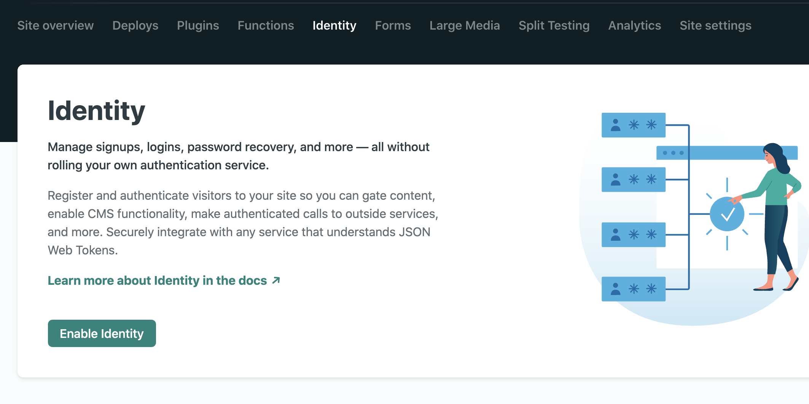
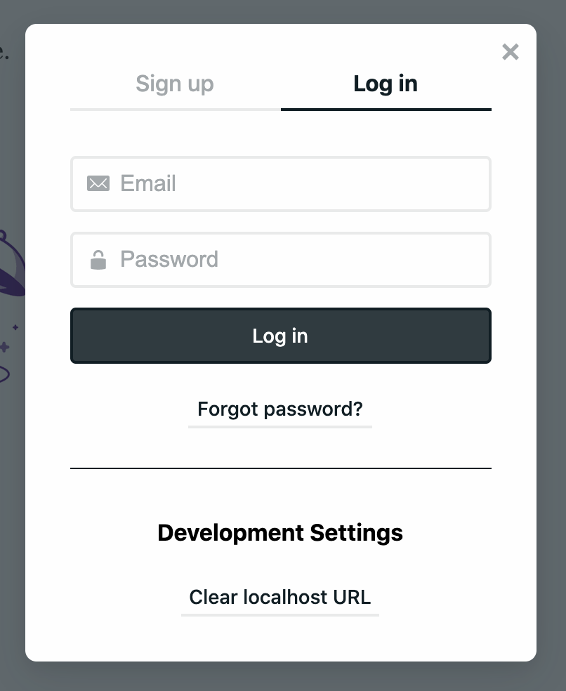

# Use with Netlify Identity

useAuth works with [netlify-identity-widget](https://github.com/netlify/netlify-identity-widget), which is designed as a zero-config login widget. You'll need 3 lines of configuration with useAuth.

Example app 👉 [example/useauth-gatsby-netlify-identity](https://github.com/Swizec/useAuth/tree/master/examples/useauth-gatsby-netlify-identity)

## 1. Set up Netlify Identity

You'll need to enable Netlify Identity for your site. Go to [netlify.com](https://netlify.com), login, find your site, and enable identity.



## 2. Install dependencies

Install both useAuth and netlify-identity-widget. We put providers in peer dependencies to reduce package sizes :)

```
yarn add react-use-auth netlify-identity-widget
```

or

```
npm install react-use-auth netlify-identity-widget
```

## 3. Configure useAuth

Netlify Identity is meant to be zero-config, but you need to configure `useAuth` itself. It needs to know you're using Netlify Identity and how to navigate on your site.

### With Gatsby

```jsx
// gatsby-browser.js

import { AuthConfig, Providers } from "react-use-auth";
import { navigate } from "gatsby";

export const wrapPageElement = ({ element }) => (
    <>
        <AuthConfig
            authProvider={Providers.NetlifyIdentity}
            navigate={navigate}
        />
        {element}
    </>
);
```

### With NextJS

```jsx
// pages/_app.js

import { AuthConfig, Providers } from "react-use-auth";
import { useRouter } from "next/router";

function MyApp({ Component, pageProps }) {
    const router = useRouter();

    return (
        <>
            <AuthConfig
                authProvider={Providers.NetlifyIdentity}
                navigate={(url) => router.push(url)}
            />
            <Component {...pageProps} />
        </>
    );
}
```

## 4. Enjoy 😊

You're ready to use `useAuth` anywhere on your site. Check the [API Reference](/docs/api-reference) for more detail.

```jsx
const Login = () => {
    const { isAuthenticated, login, logout } = useAuth();

    if (isAuthenticated()) {
        return <button onClick={logout}>Logout</Button>;
    } else {
        return <button onClick={login}>Login</Button>;
    }
};
```

Users get a widget like this:



## Using roles with Netlify Identity
