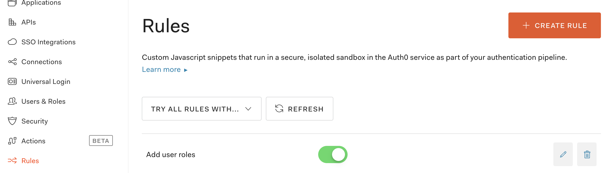

# Using roles or scopes with Auth0

[`useAuth`](https://useauth.dev) comes with built-in support for authorization.

To use it with Auth0, you'll need to configure a couple things on Auth0 and 1 on useAuth.

## 1. Add user roles to metadata

Go to your [Auth0 Dashboard](https://manage.auth0.com/dashboard) and find the `Rules` section.



Create a new blank rule, name it whatever, and paste this code:

```javascript
function (user, context, callback) {
    // replace YOUR_DOMAIN with your domain
    const namespace = 'https://YOUR_DOMAIN';
    const assignedRoles = (context.authorization || {}).roles;
    user.user_metadata = user.user_metadata || {};
    user.user_metadata.roles = assignedRoles;
    context.idToken[namespace + '/user_metadata'] = user.user_metadata;
    callback(null, user, context);
}
```

Auth0 runs this rule when useAuth fetches user data. The code adds user roles to `user_metadata` passed back to `useAuth`.

Make sure you replace `YOUR_DOMAIN` with your actual domain. Any domain will do as long as the string starts with `https://`.

## 2. Configure customPropertyNamespace

`useAuth` reads user_metadata from a customPropertyNamespace. You need to configure this in your `<AuthConfig />` call.

```jsx
 <AuthConfig
    authProvider={Providers.NetlifyIdentity}
    navigate={(url) => router.push(url)}
    params={{
        domain: "useauth.auth0.com"
        clientID: "GjWNFNOHqlino7lQNjBwEywalaYtbIzh",
        customPropertyNamespace: "https://YOUR_DOMAIN"
    }}
/>
```

Replace `YOUR_DOMAIN` with the same domain you used above.

## 3. isAuthorized

You can now use [isAuthorized](/docs/roles) to verify user authorization.
