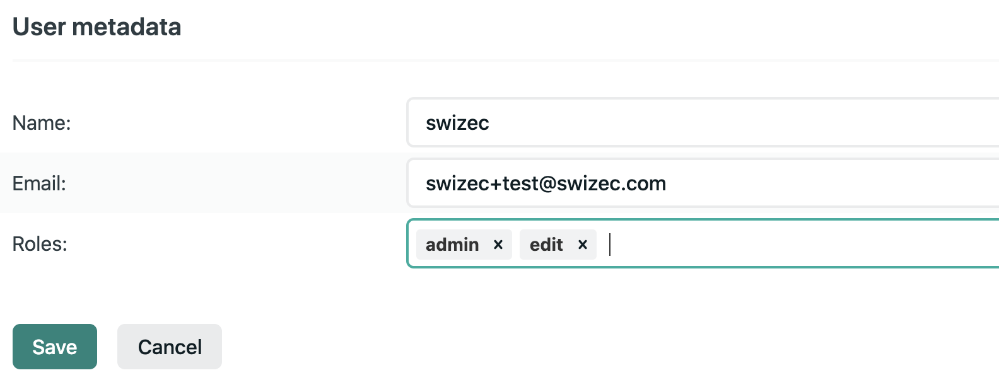

# Using roles with Netlify Identity

[`useAuth`](https://useauth.dev) comes with built-in support for authorization.

Netlify Identity requires no additional configuration to support roles. Head over to [netlify.com](https://netlify.com) and navigate to the Identity portion of your site's configuration.

## Add roles to users

Find a user that needs a role and click Edit Settings. Then type-in your roles.

Make sure you save :)

## isAuthorized

You can now use [isAuthorized](/docs/roles) to verify user authorization.
